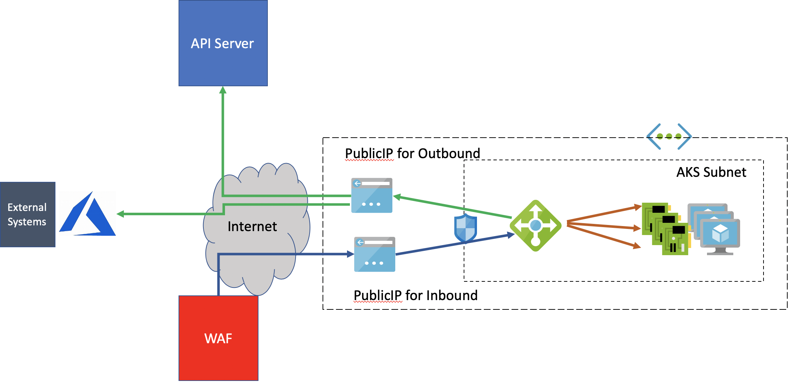

# Node Distribution
kubectl describe nodes | grep -e "Name:" -e "failure-domain.beta.kubernetes.io/zone"

# mythicalakszone.sh

This script creates the following resources:
- Resource Group. If it already exists, the creation continues without error.
- VNET & SUBNET. If it already exists, the creation continues without error.
- Container Registry.
- AKS Cluster with:
- 3 Zones
- Managed Identity
- Load Balancer Outbound IP
- Load Balancer Ingress IP
- AutoScaler
#Post installation steps to install NGINX
kubectl create namespace ingress-basic
helm repo add stable https://kubernetes-charts.storage.googleapis.com/
# Use Helm to deploy an NGINX ingress controller
helm install nginx-ingress stable/nginx-ingress \
    --namespace ingress-basic \
    --set controller.replicaCount=1 \
    --set controller.nodeSelector."beta\.kubernetes\.io/os"=linux \
    --set defaultBackend.nodeSelector."beta\.kubernetes\.io/os"=linux \
    --set controller.service.type=LoadBalancer \
    --set controller.service.externalTrafficPolicy=Local \
    --set controller.service.annotations."service\.beta\.kubernetes\.io/azure-load-balancer-resource-group"="${INGRESS_PUBLIC_IP_RESOURCE_GROUP}" \
    --set controller.service.loadBalancerIP=52.146.61.250

kubectl apply -f aks-helloworld-one.yaml --namespace ingress-basic
kubectl apply -f aks-helloworld-two.yaml --namespace ingress-basic
kubectl apply -f hello-world-ingress.yaml

    service.beta.kubernetes.io/azure-load-balancer-resource-group: mythicalakszone_RG
    service.beta.kubernetes.io/azure-dns-label-name: mythicalakszone

# mythicalakszoneAGIC.sh
- In addition to mythicalakszone.sh, adds  App Gateway Ingress controller to AKS

